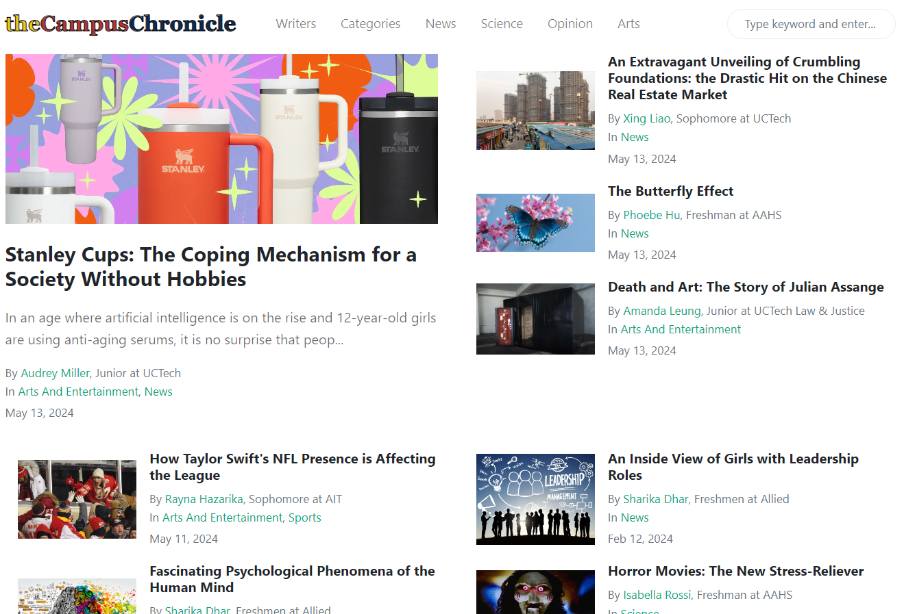
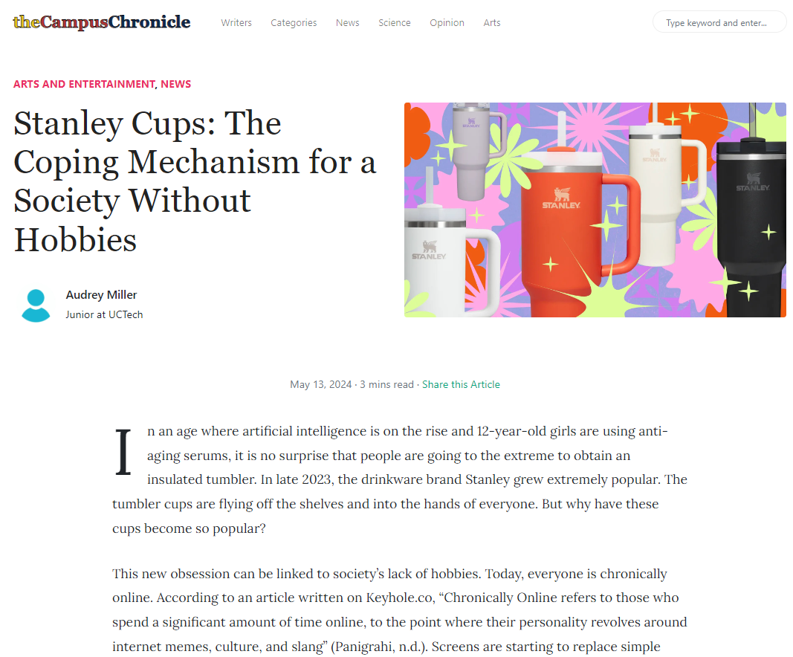
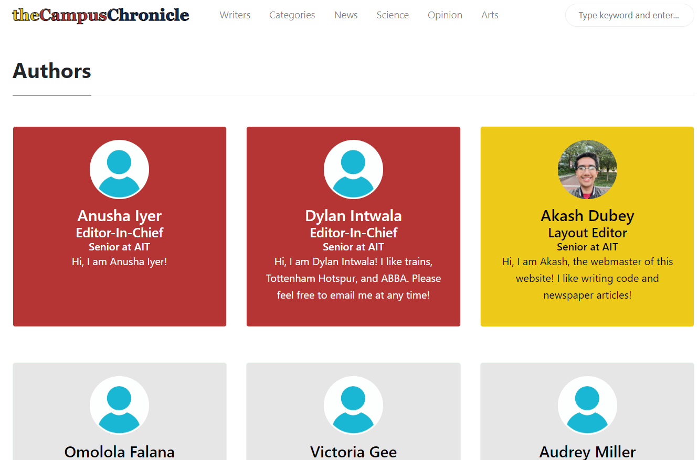
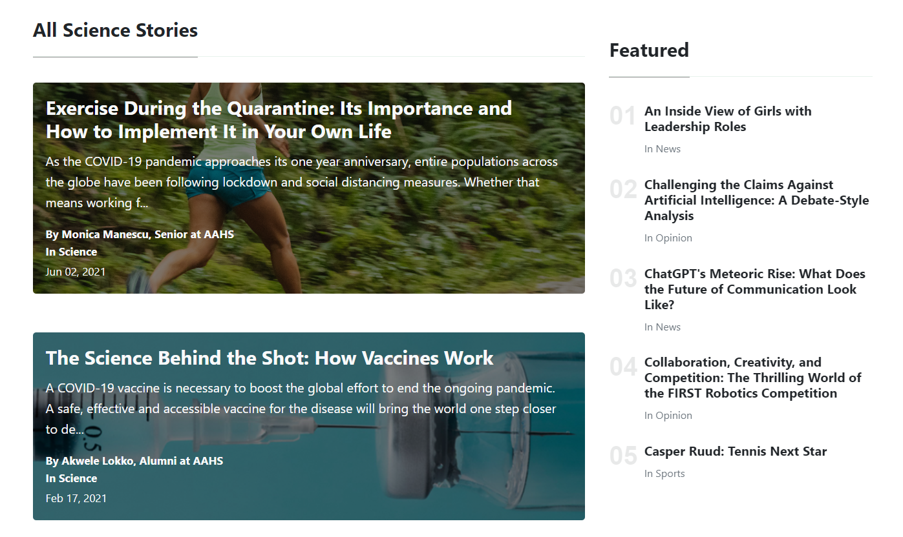

<h1 align="center">The Campus Chronicle</h1>



<h4 style="text-weight: strong;" align="center">A website for the UCVTS newspaper club to publish student articles and news.</h4>

## About
This website is built using Jekyll, a static site generator. It is hosted on GitHub Pages and the domain is managed with Hostinger. Articles are stored in the markdown format and are rendered using the Liquid templating engine. 

## Code Structure
### Articles


All of the articles are in the `_posts` folder. Each article is separated into year and edition and named in this way: `YYYY-MM-DD-title.md`. Each file also has a header which includes important meta data for each article.

```markdown
layout: post
title:  "The Campus Chronicle: How it Works"
author: [ akash ]
categories: [ Arts and Entertainment ]
image: assets/images/articles_2024/edition_2/image.jpg
tags: [ ]
```

There are a couple of categories that articles can be sorted into. These include:
- News
- Opinion
- Arts and Entertainment
- Sports
- Science

All images used in articles can either be referenced from the `assets/images` folder or from an external source.

Articles can be formatted using markdown or HTML syntax. 

### Authors
A list of all authors on the site is stored in `_config.yml`. Each author has a username which is used in the code for the site as well as some metadata.

```yaml
akash:
    name:           Akash Dubey
    avatar:         /assets/images/avatars/akash-avatar.jpg
    role:           Layout Editor
    bio:            "Hi, I am Akash!"
    email:          adubey@ucvts.org
    school:         AIT
    grade:          Senior
```

Information can be configured here to show for each author on the site. In addition, the order that these authors are listed in `_config.yml` will be the order that they are displayed on the author page. 




In addition, each author has their own page in `_pages` which has all the articles they have written. When a new author is added, a new `author-USERNAME.html` file must be created for them. 

```liquid
---
title: "Akash Dubey"
layout: default
permalink: "/author-akash-dubey.html"
---



```

### Pages


All other pages are stored in the `_pages` folder. These pages are written in markdown and have a header that includes metadata for the page. 

```markdown
title: "Link Tree"
layout: default
permalink: "/linktree.html"
```

The permalink is the slug for the page. This is the URL that the page will be accessed at. The layout is the template that the page will use. Default is fine for most pages.

We also have a couple other pages like `science.html`, `sports.html`, `opinion.html`, and `news.html`. These pages are similar to the home page but filter articles to only show articles in that category.

The other miscellaneous pages are `about.html`, `contact.html`, `comment-policy.md`, `linktree.html`, and `privacy-policy.md`. These are pretty self-explanatory.

### Components
The reusable code components are stored in the `_includes` folder. 

<!-- Create a table with file name and description -->
| File Name | Description |
| --- | --- |
| `author-content.html` | An author page with the author's articles |
| `comments.html` | Disqus comment section |
| `main-big-post.html` | The first/main article on the home or category pages |
| `main-loop-card.html` | A card for an article (with image in the background) |
| `main-sticky.html` | A big post on the home page |
| `main-top-card.html` | A card for an article (tiny and mostly used on home page) |
| `meta-read-time.html` | Calculates time to read an article (by length) |
| `search-lunr.html` | Searching logic and pop up |
| `sidebar-featured.html` | Sidebar for showing articles on right when listed out |
| `sidebar.html` | Only on About page |
| `tracking-header.html` | Google Analytics Tags |

## Development

To run this locally, delete the `Gemfile.lock` file if you have it. Download [Ruby](https://www.ruby-lang.org/en/downloads/). Check to see if it's installed `ruby -v`. If it is, run `bundle install`. Then run `bundle install`. Then run `bundle exec jekyll serve`. 

### How to add a new article
1. Create a new markdown file in the `_posts` folder.
2. Save the file with the following naming convention: `YYYY-MM-DD-title.md`.
3. Save the image in the `assets/images` folder. Make sure to keep it organized by year and edition.
4. Add the following header to the markdown file:
    ```markdown
    layout: post
    title:  "NAME OF THE ARTICLE"
    author: [ AUTHOR_USERNAME ]
    categories: [ CAREGORY ]
    image: assets/images/IMAGE_PATH
    tags: [ ] <- sticky or featured
    ```
5. Check if the author is in the `_config.yml` file. If not, add them.
6. Write the article in markdown or HTML.
7. If possible, run it locally to check for errors. If not, push it to the repository and check that it builds successfully.

All done! The article should now be live on the site!

Here is a [presentation](https://docs.google.com/presentation/d/1Uj1Jz08X1kLRDBc6Jj9cB4_aVqu3sj2PSrBlm5MK_Y8/edit?usp=sharing) with the same guide.

Here is a tutorial you can follow to add an article: 

[](https://www.youtube.com/watch?v=ugQ5J05kNYg)

Here is a video of adding some articles to the site: 

[](https://www.youtube.com/watch?v=L5-R9Mai1Yc)

### How to add a new author
1. Find the list of authors in the `_config.yml` file.
2. Add a new author in the following format:
    ```yaml
    username:
        name:           FULL NAME
        avatar:         /assets/images/avatars/anonymous.jpg
        role:           Member
        bio:            "BIO"
        email:          EMAIL
        school:         SCHOOL
        grade:          GRADE
    ```
3. Create a new author page in the `_pages` folder. The file should be named `author-USERNAME.html`.
4. Add the following header to the markdown file:
    ```markdown
    ---
    title: "FULL NAME"
    layout: default
    permalink: "/author-full-name.html"
    ---
    
    
    
    ```
5. Check that the author page is working correctly by running the site locally or checking the live site.

### Template Repository
This repository is based off of the [Mundana Jekyll Theme](https://wowthemesnet.github.io/mundana-theme-jekyll/). It has been heavily customized to fit the needs of the UCVTS newspaper club.

#### Copyright

Copyright (C) 2019 WowThemes.net.

Theme designed and developed by [Sal](https://www.wowthemes.net), *free* under MIT license. 

<a href="https://www.wowthemes.net/donate/" target="_blank"></a>

